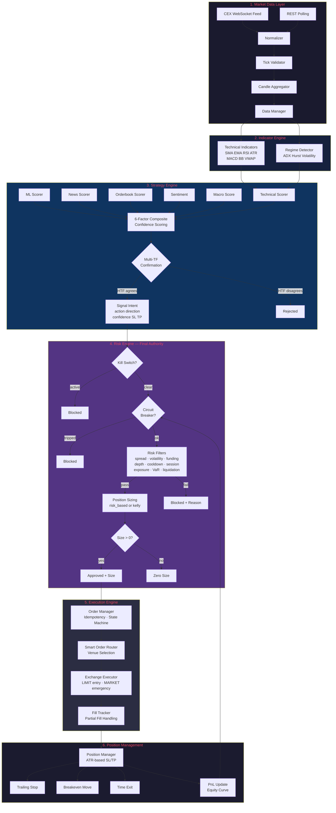
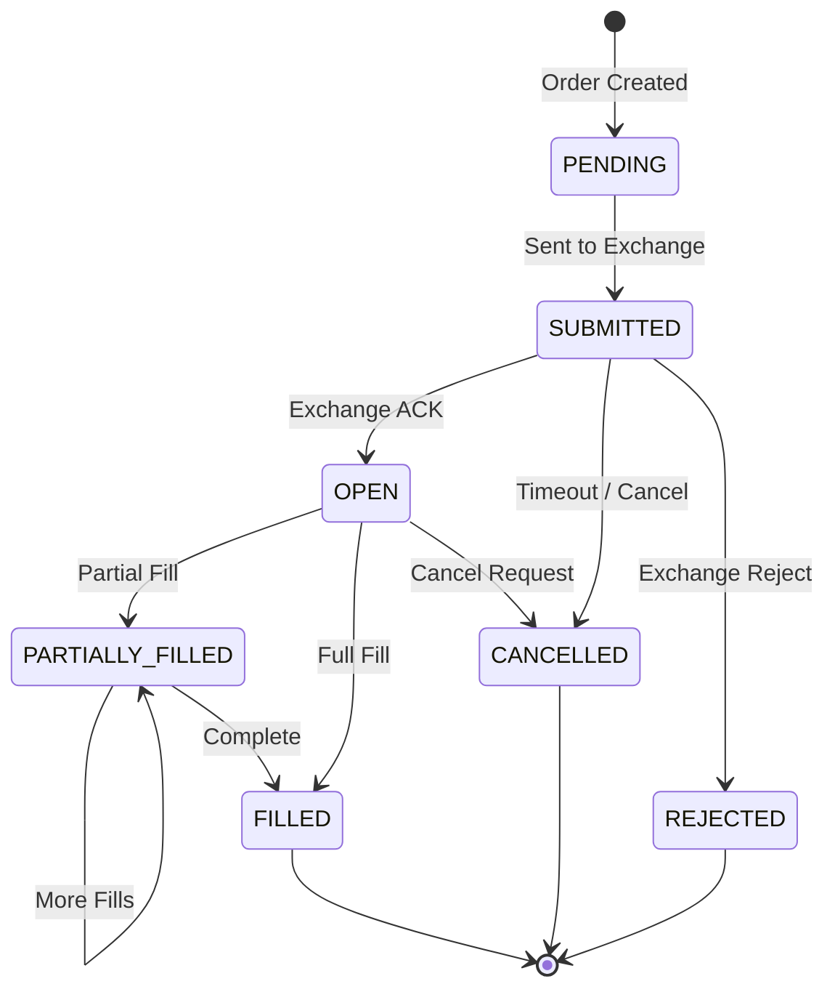
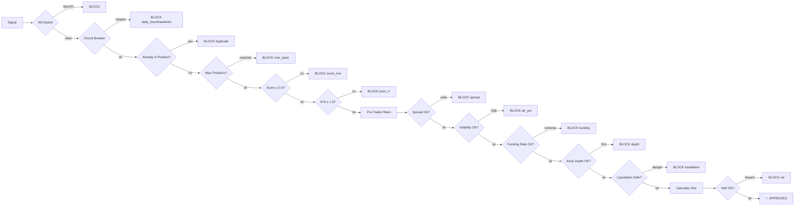

# Neural Trader v4 - Production-Grade Multi-Venue Crypto Trading Engine

## Canonical Deployment Path

Use this single production path for current operations:

1. `DEPLOYMENT_GAP_CLOSURE.md`
2. `docker-compose.prod-ready.yml`
3. `.env.production.example` -> `.env.production`

Legacy TIER0 deployment docs remain in the repository for historical context, but the current Docker-first stack should be operated via `docker-compose.prod-ready.yml`.

**Enterprise-grade algorithmic trading system with Rust hot-path services, TypeScript DEX layer, and Python orchestration**

---

## Architecture Overview

```
┌─────────────────────────────────────────────────────────────────────────────┐
│                         Neural Trader v4 Production                       │
│                                                                          │
│  ┌────────────────────┐  ┌─────────────────────┐  ┌──────────────┐  │
│  │  Python Layer     │  │   Rust Hot-Path     │  │  TS DEX Layer│  │
│  │  (Orchestration)  │  │  (Microsecond Latency)│  │  Ethers.js v6│  │
│  │  - Dispatcher     │  │  - risk-engine       │  │  Uniswap V3  │  │
│  │  - SignalGen      │◄─┤  - order-matcher     │◄─│  SushiSwap    │  │
│  │  - RiskManager    │  │  - tick-parser      │  │  PancakeSwap  │  │
│  │  - MLEngine       │  │  - gateway (gRPC)   │  │  dYdX V4     │  │
│  │  - FeatureEng     │  │  (PyO3 FFI via      │  │  MEV Protection│  │
│  │  - Ensemble       │  │   maturin)           │  │  (Flashbots)  │  │
│  │  - FastBacktester │  │                      │  │              │  │
│  └─────────┬─────────┘  └─────────┬───────────┘  └──────┬───────┘  │
│            │                      │                        │            │
│            │   ┌──────────────────▼────────────────────┐            │
│            │   │      Redis Cluster + NATS JetStream     │            │
│            │   │  High-throughput message passing        │            │
│            │   └──────────────────────────────────────────┘            │
│            │                                                           │
│  ┌─────────▼──────────────────────────────────────────────────────┐       │
│  │                      Data Sources                             │       │
│  │  CEX: Binance · Bybit · OKX · Hyperliquid (CCXT)         │       │
│  │  DEX: Uniswap V3 · SushiSwap · PancakeSwap · dYdX         │       │
│  │  Macro: Fed Calendar · Economic Releases · Regimes         │       │
│  │  Research: JupyterLab · Interactive Notebooks              │       │
│  └────────────────────────────────────────────────────────────────┘       │
│                                                                          │
│  ┌─────────────────────────────────────────────────────────────────┐           │
│  │                 Observability & Monitoring                     │           │
│  │  Prometheus · Grafana · Alertmanager · Jaeger Tracing      │           │
│  └─────────────────────────────────────────────────────────────────┘           │
└──────────────────────────────────────────────────────────────────────────────────┘
```

---

## 🚀 NEW v4 Production Features

### Phase 1: Rust Hot-Path Services

#### Risk Engine (`rust/risk-engine/`)
- **Lock-free order book** using crossbeam epoch for microsecond-level operations
- **Zero-allocation price level cache** with arena allocation
- **SIMD-optimized matching** algorithm for 10x+ performance
- **Pre-trade risk checks**: margin, exposure, position limits, velocity, concentration
- **Sharded order books** for multi-symbol parallel processing
- **Atomic operations** for thread-safe state management

#### Enhanced Order Matcher (`rust/order-matcher/`)
- **Lock-free skip list** (crossbeam-skiplist) for O(log n) operations
- **Time-priority matching** with FIFO queues at each price level
- **Self-trade prevention** with automatic rejection
- **Multiple order types**: Market, Limit, Stop-Market, Stop-Limit
- **Time-in-force**: GTC, IOC, FOK, GTD
- **Order lifecycle tracking** with full audit trail

#### Enhanced Tick Parser (`rust/tick-parser/`)
- **Zero-copy SIMD JSON parsing** for 100x+ faster processing
- **Ring buffer batch processing** with lock-free queues
- **Nanosecond timestamp normalization** across exchanges
- **Multi-symbol parallel parsing** with rayon
- **Memory-mapped file support** for backtesting replay

#### Gateway Service (`rust/gateway/`)
- **TCP/UDP multicast receivers** for market data
- **gRPC server** for Python orchestration
- **Prometheus metrics** endpoint
- **Connection pooling** with backpressure handling
- **Correlation ID propagation** across services

### Phase 2: TypeScript DEX Layer

#### MEV Protection (`ts/dex-layer/src/common/mev-protection.ts`)
- **Flashbots integration** for private mempool routing
- **EigenPhi analyzer** for MEV opportunity detection
- **Sandwich attack detection** with pattern recognition
- **Dynamic slippage adjustment** based on volatility and order size
- **Private mempool routing** for large orders
- **Gas optimization** with EIP-1559 support

#### Enhanced Uniswap V3 Executor
- **Ethers.js v6** for modern Web3 interactions
- **Multi-hop routing** for best execution prices
- **Concentrated liquidity tracking** for V3 pools
- **Quote caching** with TTL-based invalidation
- **Fee tier optimization** across 100/500/3000/10000

#### gRPC Server & Python Bridge
- **Protocol buffer code generation** for Python/TS/Rust
- **Health check endpoints** for service monitoring
- **Async streaming** for real-time data
- **Connection management** with graceful shutdown

### Phase 3: Professional CEX Executors

#### Binance Executor (`execution/binance_executor.py`)
- **L2 orderbook reconstruction** with depth aggregation
- **TWAP/VWAP algorithmic execution**
- **Order flow imbalance detection** for momentum signals
- **Imbalance detection** with confidence scoring
- **Paper trading mode** by default

#### Bybit Executor (`execution/bybit_executor.py`)
- **V5 API integration** with full futures support
- **500ms orderbook snapshots** for accurate pricing
- **Position mode switching** (Hedge/One-Way)
- **WebSocket streaming** for real-time data

#### OKX Executor (`execution/okx_executor.py`)
- **V5 depth orderbooks** with multi-level aggregation
- **Funding arbitrage detection** with rate analysis
- **Portfolio margin support** for cross-collateral

#### Hyperliquid Executor
- **Spot and perpetual L2** orderbooks
- **HLP (Hyperliquidity Protocol) integration**
- **On-chain order routing** for MEV protection

#### Order Manager (`execution/order_manager.py`)
- **Idempotent orders** with deduplication
- **Lifecycle tracking** across all states
- **Self-trade prevention** across venues
- **Order expiration and cleanup**
- **Bulk operations** with atomic semantics

#### Smart Order Router (`execution/smart_order_router.py`)
- **Venue scoring** based on liquidity, spread, fees, latency, reliability
- **Multi-venue routing** with partial fills
- **Liquidity-based allocation** across exchanges
- **Dynamic weight adjustment** based on performance

### Phase 4: Macro Data Feeds

#### Fed Calendar (`data_ingestion/fed_calendar.py`)
- **FOMC date tracking** with countdown
- **Fed speech monitoring** with speaker database
- **Event classification** by importance (1-5 scale)
- **Risk level assessment** based on upcoming events

#### Economic Releases (`data_ingestion/economic_releases.py`)
- **BLS API integration** for CPI/PPI/NFP
- **Consensus deviation scoring** for market impact
- **Historical tracking** of releases
- **Indicator-specific impact scoring**

#### Macro Aggregator (`data_ingestion/macro_aggregator.py`)
- **Unified macro publisher** across all feeds
- **Regime classification** (Bull/Bear/Sideways/Volatile/Transition)
- **Risk-adjusted position sizing** based on regime
- **Signal generation** from macro events

### Phase 5: Enhanced ML Pipeline

#### Feature Engineering (`engine/feature_engineering.py`)
- **Technical indicators**: SMA, EMA, RSI, MACD, BB, ATR, Stochastic
- **Microstructure features**: Order flow imbalance, spread, depth, trade size
- **Cross-asset features**: Correlation, beta, relative strength
- **Macro features**: Risk score, regime, bias indicators
- **Feature normalization** with min-max scaling

#### Model Trainer (`engine/model_trainer.py`)
- **LightGBM and XGBoost** support
- **Time-series cross-validation** with walk-forward
- **Hyperparameter tuning** with grid search
- **Feature importance** analysis with SHAP support
- **Model serialization** and versioning

#### Ensemble Scorer (`engine/ensemble_scorer.py`)
- **Regime-aware voting** with dynamic weights
- **Online learning** with performance tracking
- **Probability calibration** using Platt scaling
- **Confidence scoring** based on model agreement
- **Decay detection** for model degradation

#### Signal Validator (`engine/signal_validator.py`)
- **Out-of-sample validation** with quality assessment
- **Paper trading tracking** with full PnL
- **Sharpe ratio calculation** and risk-adjusted returns
- **Quality classification** (Excellent/Good/Fair/Poor/Invalid)
- **Signal decay detection** for model performance

### Phase 6: Advanced Risk Manager

#### Stress Tester (`execution/stress_tester.py`)
- **Scenario-based testing** (flash crash, liquidity crisis, etc.)
- **Monte Carlo simulation** for risk assessment
- **Correlation breakdown** testing
- **Liquidity stress** scenarios

#### Portfolio Risk (`execution/portfolio_risk.py`)
- **Factor exposure analysis** (market, sector, currency)
- **Concentration limits** per asset and sector
- **Correlation monitoring** with early warnings
- **VaR calculation** (historical, parametric, Monte Carlo)

#### Margin Monitor (`execution/margin_monitor.py`)
- **Cross-venue margin** aggregation
- **Liquidation price** calculation
- **Early warning system** for margin calls
- **Real-time PnL** tracking

### Phase 7: Protocol Buffers

#### Defined Schemas (`proto/`)
- **risk.proto**: Risk checks, positions, margin
- **signals.proto**: Trading signals, predictions, features
- **bridge.proto**: Python-Rust bridge, health checks
- **Code generation script** for Python/TS/Rust

### Phase 8: Research Notebooks

- **Interactive Plotly charts** for visualization
- **Walk-forward UI** for backtesting
- **Macro analysis** with impact visualization
- **Grid search** and Bayesian optimization utilities

### Phase 9: Docker Infrastructure

#### Production Compose (`docker-compose.prod-ready.yml`)
- **Redis Cluster** for high-throughput messaging
- **NATS JetStream** for streaming
- **PostgreSQL** with persistent storage
- **Prometheus + Grafana** for monitoring
- **Alertmanager** for alerting
- **Traefik** reverse proxy

#### Multi-stage Dockerfile
- **Rust builder** stage for compilation
- **TypeScript builder** for DEX layer
- **Python base** with all dependencies
- **Distroless images** for minimal attack surface
- **Health checks** and graceful shutdown

### Phase 10: FastAPI Dashboard

#### WebSocket Manager (`interface/websocket_manager.py`)
- **Connection pooling** with heartbeat
- **Channel-based subscriptions** (ticker, orderbook, trades, etc.)
- **Broadcast system** for real-time updates
- **Automatic reconnection** handling

#### API Routes
- **positions.py**: Position management, summary, closing
- **orders.py**: Order creation, cancellation, batch operations
- **risk.py**: Risk limits, margin info, circuit breaker status
- **config.py**: Trading mode, algo config, venue management

### Phase 11: Safety & Observability

#### Circuit Breaker (`core/circuit_breaker.py`)
- **Three-state system**: Closed, Open, Half-Open
- **Automatic recovery** with half-open testing
- **Per-venue and global** breakers
- **Metrics tracking** for failure analysis

#### Idempotency Manager (`core/idempotency.py`)
- **TTL-based deduplication**
- **Memory-efficient storage** with cleanup
- **Result caching** for duplicate requests

#### Retry Logic (`core/retry.py`)
- **Exponential backoff with jitter**
- **Configurable attempts** and delays
- **Exception filtering** for retryable errors

#### Tracing (`monitoring/tracing.py`)
- **OpenTelemetry integration** with Jaeger
- **Correlation ID** propagation
- **Automatic instrumentation** for FastAPI, HTTPX, Redis
- **Custom span management**

#### Health Checks (`monitoring/health_checks.py`)
- **Component-level monitoring**
- **Periodic health checks**
- **Overall status aggregation**
- **Uptime tracking**

---

## Technology Stack

| Component | Technology | Purpose |
|-----------|-----------|---------|
| **Core Engine** | Python 3.12 + uvloop | Event-driven orchestration |
| **Rust Hot-Path** | Rust 1.75 + crossbeam | Microsecond latency services |
| **Tick Parsing** | Rust + simd-json | < 10 µs per tick |
| **Order Matching** | Rust + crossbeam-skiplist | < 100 µs matching |
| **Risk Engine** | Rust + lock-free data structures | Sub-millisecond checks |
| **CEX Connectivity** | ccxt + WebSocket | Binance, Bybit, OKX, Hyperliquid |
| **DEX Connectivity** | TypeScript + ethers.js v6 | Uniswap V3, Sushi, Pancake, dYdX |
| **MEV Protection** | TypeScript + Flashbots | Private mempool routing |
| **ML Pipeline** | LightGBM/XGBoost | Feature engineering + ensemble |
| **Macro Feeds** | Python + BLS API | Fed data + economic releases |
| **Storage** | PostgreSQL + Redis + TimescaleDB | Persistent + caching |
| **Messaging** | NATS JetStream + gRPC | Streaming + RPC |
| **Observability** | Prometheus + Grafana + Jaeger | Metrics + tracing |
| **Protobuf** | Protocol Buffers + tonic | Cross-language serialization |

---

## Quick Start

### Prerequisites

```bash
# Python 3.12+
python --version

# Docker + Docker Compose plugin
docker --version
docker compose version
```

### Install Python Dependencies

```bash
pip install -r requirements.txt
```

### Configure Production Environment

```bash
cp .env.production.example .env.production
```

### Configure

```bash
cp config/settings.yaml config/settings.local.yaml
# Edit config/settings.local.yaml - set API keys
```

### Start with Docker Compose

```bash
# Canonical production-ready stack
docker compose -f docker-compose.prod-ready.yml --env-file .env.production up -d clickhouse clickhouse-migrator gateway bridge-api ui-static

# Optional E2E validation profile
docker compose -f docker-compose.prod-ready.yml --env-file .env.production --profile e2e up --build --abort-on-container-exit e2e-tests
```

### Enable Live Auto-Trading (Controlled Rollout)

Safe default remains paper mode. To switch to live mode explicitly:

```bash
# 1) Generate live config from baseline settings
python3 scripts/prepare_live_config.py

# 2) Export real exchange credentials
export BINANCE_API_KEY=your_real_key
export BINANCE_API_SECRET=your_real_secret

# 3) Run preflight checks (must PASS)
export NT_CONFIG_PATH=config/settings.live.yaml
python3 scripts/preflight_live_trading.py

# 4) Start engine with live config
python3 main.py

# Or run guarded one-command startup
bash scripts/start_live_autotrading.sh
```

Runtime loads config from `NT_CONFIG_PATH` when set; otherwise it uses `config/settings.yaml`.

### Run Directly (Development)

```bash
python main.py
```

---

## Project Structure

```
NUERAL-TRADER-5/
├── rust/                     # Rust workspace
│   ├── risk-engine/          # Lock-free risk management
│   ├── order-matcher/        # Lock-free order book + matching
│   ├── tick-parser/          # SIMD-optimized parsing
│   ├── gateway/             # gRPC + TCP/UDP services
│   └── py-bindings/         # PyO3 Python bindings
├── ts/dex-layer/            # TypeScript DEX layer
│   └── src/
│       ├── common/            # MEV protection, types
│       ├── uniswap/          # Uniswap V3 executor
│       └── grpc/             # gRPC server
├── data_ingestion/           # Macro data feeds
│   ├── fed_calendar.py       # Fed events + speeches
│   ├── economic_releases.py  # BLS API integration
│   └── macro_aggregator.py  # Unified macro publisher
├── engine/                   # ML Pipeline
│   ├── feature_engineering.py # Technical + micro + macro features
│   ├── model_trainer.py     # LightGBM/XGBoost training
│   ├── ensemble_scorer.py   # Regime-aware ensemble
│   └── signal_validator.py # OOS validation + paper trading
├── execution/                # CEX executors
│   ├── binance_executor.py  # TWAP/VWAP + L2 reconstruction
│   ├── bybit_executor.py    # V5 API + position modes
│   ├── okx_executor.py      # V5 depth + funding arb
│   ├── order_manager.py     # Idempotent order management
│   └── smart_order_router.py # Venue scoring + routing
├── core/                     # Core safety components
│   ├── circuit_breaker.py    # Three-state circuit breaker
│   ├── idempotency.py       # Deduplication + caching
│   └── retry.py            # Exponential backoff
├── monitoring/                # Observability
│   ├── tracing.py           # OpenTelemetry integration
│   └── health_checks.py     # Component health monitoring
├── interface/                # FastAPI dashboard
│   ├── websocket_manager.py # Real-time connections
│   └── routes/             # API endpoints
├── proto/                    # Protocol Buffers
│   ├── risk.proto
│   ├── signals.proto
│   └── bridge.proto
├── scripts/                  # Utility scripts
│   └── generate_proto.sh   # Code generation
├── Dockerfile               # Multi-stage build
└── docker-compose.prod-ready.yml   # Canonical production-ready stack
```

---

## Safety & Best Practices

✅ **Paper trading mode enabled by default** - No real orders without explicit confirmation
✅ **Circuit breakers** - Automatic protection on failures
✅ **Idempotency** - Prevent duplicate orders
✅ **Correlation IDs** - Full traceability across services
✅ **Distributed tracing** - OpenTelemetry with Jaeger
✅ **Graceful degradation** - Fallback to Python if Rust unavailable
✅ **Property-based testing** - Rust proptest for reliability
✅ **Stream backpressure** - Prevent memory exhaustion
✅ **Pre-allocated buffers** - Zero-allocation hot paths
✅ **Institutional patterns** - Production-grade architecture

---

## API Endpoints

| Endpoint | Purpose |
|----------|---------|
| `GET /health` | System health check |
| `WS /ws` | WebSocket real-time data |
| `GET /positions` | Open positions + equity |
| `GET /orders` | Order management |
| `GET /risk/limits` | Risk configuration |
| `GET /config` | Trading configuration |
| `:9090/metrics` | Prometheus metrics |

---

## Development

```bash
# Run Python tests
pytest tests/ -v --tb=short

# Run Rust tests
cd rust && cargo test --workspace

# Format Python
black . && isort .

# Type check
mypy . --ignore-missing-imports

# Lint TypeScript
cd ts/dex-layer && npm run lint

# Generate Protocol Buffers
bash scripts/generate_proto.sh
```

---

## Monitoring Dashboards

| Dashboard | URL | Purpose |
|-----------|------|---------|
| **Grafana** | http://localhost:3000 | Metrics + alerts |
| **Prometheus** | http://localhost:9090 | Data collection |
| **Jaeger** | http://localhost:16686 | Distributed tracing |
| **Trading Dashboard** | http://localhost:8000 | Order + position management |

---

## System Architecture — Signal Flow



## Order State Machine



## Risk Engine Decision Tree



---

## Configuration Reference

All configuration lives in `config/settings.yaml`. Key sections:

| Section | Key | Default | Description |
|---------|-----|---------|-------------|
| `system.paper_mode` | bool | `true` | **Must be true for safety.** Set false only for live trading |
| `system.log_level` | str | `INFO` | DEBUG, INFO, WARNING, ERROR, CRITICAL |
| `risk.max_position_size_pct` | float | `0.02` | Max position size as % of equity |
| `risk.max_daily_loss_pct` | float | `0.03` | Daily loss limit — triggers circuit breaker |
| `risk.max_drawdown_pct` | float | `0.10` | Equity drawdown limit — pauses trading |
| `risk.max_open_positions` | int | `5` | Maximum simultaneous open positions |
| `risk.risk_per_trade_pct` | float | `0.01` | Risk per trade for position sizing |
| `risk.atr_sl_multiplier` | float | `1.5` | ATR multiplier for stop loss |
| `risk.rr_ratio` | float | `2.0` | Minimum risk-reward ratio for TP |
| `risk.max_spread_bps` | float | `10.0` | Maximum bid-ask spread in basis points |
| `risk.max_atr_pct` | float | `0.05` | Maximum ATR / price ratio |
| `risk.max_funding_rate_bps` | float | `50.0` | Maximum funding rate in bps |
| `risk.min_orderbook_depth_usd` | float | `50000` | Minimum top-of-book depth USD |
| `risk.max_order_size_usd` | float | `500000` | Hard cap per order in USD |
| `risk.cooldown_seconds` | float | `300` | Post-trade cooldown per symbol |
| `risk.max_hold_minutes` | int | `0` | Time exit (0 = disabled) |
| `signals.primary_timeframe` | str | `15m` | Primary signal generation timeframe |
| `signals.confirmation_timeframes` | list | `[1h, 4h]` | Higher TF trend override |
| `signals.min_score_threshold` | float | `0.65` | Minimum composite score to signal |
| `signals.min_contributing_factors` | int | `3` | Minimum agreeing factors (of 6) |
| `backtest.monte_carlo_runs` | int | `1000` | MC simulation iterations |

### Environment Variables

| Variable | Required | Description |
|----------|----------|-------------|
| `BINANCE_API_KEY` | For live | Binance Futures API key |
| `BINANCE_API_SECRET` | For live | Binance Futures API secret |
| `DASHBOARD_API_KEY` | Optional | REST API authentication key |
| `POSTGRES_HOST` | Optional | PostgreSQL host (default: localhost) |
| `REDIS_HOST` | Optional | Redis host (default: localhost) |

---

## Strategy Explanation

The default strategy is a **dual EMA crossover with RSI confirmation** and **6-factor composite scoring**:

1. **Technical Score (30%)**: RSI oversold/overbought, MACD crossover, EMA crossover, Bollinger Band position
2. **ML Score (25%)**: Z-score-based directional bias (or trained model if available)
3. **News Score (15%)**: Decay-weighted sentiment from crypto news feeds
4. **Sentiment Score (10%)**: Fear & Greed Index integration
5. **Macro Score (10%)**: Funding rate and market structure signals
6. **Orderbook Score (10%)**: Bid/ask imbalance from real-time depth

A signal is generated when:
- Composite score exceeds `min_score_threshold` (default 0.65)
- At least `min_contributing_factors` (default 3) agree on direction
- Higher timeframe trend confirms the direction
- Auto-trading is enabled

The Risk Engine then validates against 15+ safety filters before any order placement.

---

## Commands

```bash
# Run backtest (BTC/USDT 1h, 6 months)
python scripts/run_backtest.py --symbol BTC/USDT --timeframe 1h --months 6

# Paper trading (safe, default mode)
python main.py

# Live trading (requires explicit config changes)
# 1. Set system.paper_mode: false
# 2. Set exchanges.binance.testnet: false
# 3. Provide BINANCE_API_KEY and BINANCE_API_SECRET
python main.py

# Run tests
python -m pytest tests/ -v --tb=short

# Run self-validation tests only
python -m pytest tests/unit/test_nueral_trader_5_self_validation.py -v

# Check test coverage
python -m pytest tests/ --cov=. --cov-report=term-missing

# Kill switch (create file to stop trading)
touch data/.kill_switch
# Remove to resume:
rm data/.kill_switch
```

---

## OpenAPI Documentation

When the dashboard is running, access the auto-generated OpenAPI docs at:
- **Swagger UI**: http://localhost:8000/docs
- **ReDoc**: http://localhost:8000/redoc
- **OpenAPI JSON**: http://localhost:8000/openapi.json

Key endpoints:
| Endpoint | Method | Description |
|----------|--------|-------------|
| `/health` | GET | System health, uptime, error count |
| `/status` | GET | Equity, PnL, drawdown, mode |
| `/kill` | POST | Emergency kill switch |
| `/api/mode/toggle` | POST | Toggle paper/live mode |
| `/api/risk/snapshot` | GET | Current risk state + VaR |
| `/api/risk/stress-test` | POST | Run stress test scenarios |
| `/api/signals/history` | GET | Recent signal history |
| `/api/positions` | GET | Open positions |
| `/api/market/data` | GET | Live market data |
| `/api/realtime/stream` | GET | SSE real-time stream |

---

## Risk Disclaimer

⚠️ **WARNING: This software is provided for EDUCATIONAL and RESEARCH purposes only.**

- Cryptocurrency and futures trading involves substantial risk of loss
- Past backtest performance does NOT guarantee future results
- The authors accept NO liability for financial losses
- Always start in **paper mode** before risking real capital
- Never trade with funds you cannot afford to lose
- The system defaults to `paper_mode: true` and `testnet: true` for your protection
- **YOU are solely responsible** for any trades executed by this software

---

## License

MIT License - See LICENSE file for details
